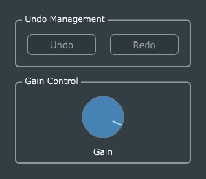

# The BasicGain effect

The **BasicGain** effect is the simplest JUCE audio plug-in which performs a parameter-driven transformation on an audio stream. It's essentially the original "Empty" effect, updated for the JUCE 5.4.x framework. Study this code first, to understand the "boilerplate" you'll see (in expanded form) in all of the other projects.

## Parameter handling
Reiss and McPherson's original code examples made use of *setParameter()* and *getParameter()*, two methods of the **juce::AudioProcessor** class which have been deprecated in more recent versions of the JUCE framework.

In JUCE 5.x, the recommended approach to plug-in parameter handling is to use **juce::AudioProcessorValueTreeState** and numerous related classes. These appear to have had a long and troublesome gestation, but now seem ready for regular use. The basic approach is:
1. Add an **AudioProcessorValueTreeState** data member to the main **AudioProcessor**-derived class.
2. Initialize this member in the initializer list for the main AudioProcessor's constructor, linking it to the AudioProcessor object itself, an optional **UndoManager** object (in *BasicGain*, also a data member of the AudioProcessor), and an **AudioProcessorValueTreeState::ParameterLayout** instance, which defines all of the actual parameters.
3. Derive some classes from **AudioProcessorValueTreeState::Listener**, and attach them to individual parameters, so as to update an ordinary variable (float, int, etc.) which the main AudioProcessor's *processBlock()* function can use. This is more efficient than having to look up the parameter value in the value tree every time.
4. Use helper classes like **AudioProcessorValueTreeState::SliderAttachment** to connect each parameter to the corresponding control widget in the plug-in's GUI.

In all the updated audio effect projects, steps 2, 3, and 4 above are handled by a special "parameters" class; in *BasicGain* this is called *GainParameters*.
* A **GainParameters** data member called *parameters* is added to the main AudioProcessor.
* It has ordinary member variables which contain the "working values" of the plug-in parameters. In *BasicGain* there is only one parameter, *Gain*, which is decibel-valued, but the "working value" member *linearGain* holds the converted value in the range 0.0 to 1.0.
* The decibel-to-linear-gain conversion is handled by the class **GainParameters::FloatDecibelListener**, specifically in its *parameterChanged()* callback function.

It's worth understanding that *BasicGain*'s single *Gain* parameter can have three distinct value ranges, which are used in different contexts:
1. The *user* will see only the decibel values, which may range from -100 dB to +12 dB.
2. The audio-processing code sees only the *linearGain* variable, which gets "magically" updated with the equivalent linear gain value every time the *Gain* parameter is changed, through the attached *FloatDecibelListener* object, whose *parameterChanged()* callback simply calls the utility function *juce::Decibels::decibelsToGain()*.
3. The *plug-in host* sees a "normalized" representation of the dB values, mapped onto the range 0.0 to 1.0. (This is a simple linear mapping, NOT dB-to-linear-gain conversion.) This value normalization is an aspect of how JUCE handles and hides the differences among different plug-in standards (e.g. VST2/3, AU, etc.).

In an *AudioProcessorValueTreeState*, every plug-in parameter has three unique *juce::String*s, which are defined as `static const String` in the "parameters" class:
1. The "ID" string (in this case "gain") identifies the parameter. It serves as a lookup key in the *AudioProcessorValueTreeState::ParameterLayout* data structure.
2. The "name" string (in this case "Gain") is a user-friendly name which will be displayed by the host.
3. The "label" string is essentially for units of measure, e.g. "dB" for decibels.

**AudioProcessorValueTreeState** defines several "attachment" classes, which effectively link ("attach") parameters to GUI controls. In *BasicGain*, a single **SliderAttachment** object is used. Because this object must be created when the GUI is instantiated, and destroyed when the GUI is deleted, a *std::unique_ptr* member (called *gainAttachment*) is used. The *GainParameters* class has function members *attachControls()* and *detachControls()* which manage this creation/destruction of attachment objects.

The *BasicGain* effect has only a single float-valued parameter, but the basic code structure of the *GainParameters* class can be extended to handle many parameters of various types. All of the effect projects have a comparably-structured "parameters" class.

## Persisting plug-in state
A major advantage of **AudioProcessorValueTreeState** is that it simplifies implementation of the AudioProcessor *getStateInformation()* and *setStateInformation()* methods to little more than a single function call.

Note, however, that if your plug-in's state includes data items other than user- and host-accessible parameters, you will need to add code to *getStateInformation()* and *setStateInformation()* to persist and recover these data.

## Graphical User Interface
In order to provide a graphical user interface (GUI) which is visually compact, respectable-looking, and easy to use, *BasicGain* and all of the rewritten plug-ins apply six programming constructs, as follows:
1. "Attachments", e.g., **AudioProcessorValueTreeState::SliderAttachment** are used to establish two-way linkage between GUI widgets and the corresponding parameters in the value tree.
2. Only standard JUCE control widgets such as **Slider** and **ComboBox** are used, as opposed to fully-custom widgets derived from **juce::Component** (a common practice for commercial plug-ins). This is necessary in order to use the attachment classes.
3. A custom **juce::LookAndFeel** class is implemented, in order to at least partially customize the appearance of standard JUCE widgets. This is mainly done to provide conventional circular knobs instead of JUCE's slightly odd-looking "rotary sliders".
4. Every parameter has a defined *default value*, and double-clicking the corresponding knob reverts the corresponding parameter's value to the default. (This is standard optional behaviour built into **juce::Slider**.)
5. Addition of a *LabeledKnob* class, which implements the [Decorator pattern](https://en.wikipedia.org/wiki/Decorator_pattern) to simplify programming for the common case of a parameter knob with a label below it, where the label is made triple-duty, so as to make the GUI more powerful while remaining oompact. Each label:
 - Indicates the knob's associated *parameter name*, when the knob is not in use.
 - Provides a *dynamic, numeric readout of the parameter value*, while the knob is adjusted.
 - Can be double-clicked to become a *text editor*, allowing the user to type in a specific numeric value.
6. Use of **juce::GroupComponent** to provide visual separation of related elements in the GUI.

These methods are based on earlier projects of mine, including [VanillaJuce](https://github.com/getdunne/VanillaJuce), [SARAH](https://github.com/getdunne/SARAH), and [juce-AudioProcessorValueTreeStateTest](https://github.com/getdunne/juce-AudioProcessorValueTreeStateTest), as well as several of the official [JUCE Tutorials](https://juce.com/learn/tutorials).

## Undo and Redo
Another major advantage of using **AudioProcessorValueTreeState** is that it features built-in support for "undo" and "redo" functionality. This is implemented in *BasicGain* (so as to show how it's done), but not in the others (to keep them simple). You should be able to add undo/redo to any of the other plug-ins quite easily, by following the basic pattern here.
