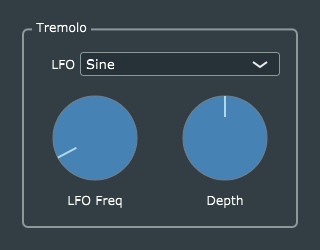

# Tremolo

The *Tremolo* effect is essentially a version of *BasicGain* where the gain is modulated by a low-frequency oscillator (LFO).

The DSP (audio processing) code illustrates:
 * a very basic LFO implementation
 * using a *state variable* `lfoPhase` to maintain the state of a process (LFO) across multiple invocations of *processBlock()*.
 * processing any number of audio channels in an identical way, in this case, by applying the identical sequence of LFO samples to each channel. For each channel, a local variable `phi` is repeatedly set to the value of `lfoPhase`, then incremented by a pre-computed delta value `deltaPhi` for each sample. The state-variable `lfoPhase` is advanced only after all channels have been processed.

The GUI and parameters code illustrates how the basic parameter-management techniques found in *BasicGain* are extended to cover:
 * multiple parameters
 * use of a scale factor to convert a percentage parameter to a working value in the range [0, 1]
 * new parameter *types*, in this case an enumeration (*DSP::Waveform*)
