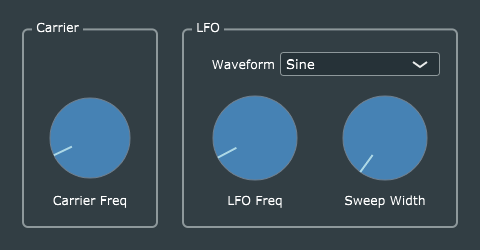

# Ring Modulator

## Comparison with Tremolo and BasicGain
Ring modulation is essentially just amplitude modulation, so the core computation (multiplication of the input signal by a periodic signal from an oscillator) is the same as in the Tremolo effect, with just three main differences in the code:
1. We use an audio-frequency oscillator instead of a low-frequency oscillator.
2. The oscillator produces only sine waves. (More complex waveforms would result in very harsh sounds at the output -- try it.)
3. The oscillator is bipolar (output range [-1, +1], not [0, 1] as in the Tremolo), and is simply multiplied by the input signals.

The third code change reflects a very important *conceptual difference* between tremolo and ring modulation. In the tremolo, we think of the LFO as acting upon the input signal to vary ("modulate") its magnitude. In ring modulation, we think of the oscillator signal as a constant "carrier" which is modulated by the input signal. This is exactly the same as in an AM radio transmitter, where a sinusoidal "carrier" is multiplied by ("modulated") by an input audio signal; the only difference is that in radio, the carrier frequency is well above the range of audio frequencies.

In tremolo, we used a biased LFO (output range [0, 1]) and crafted the modulation computation in such a way that the LFO output acted like a person repeatedly turning the gain control of the *BasicGain* effect back and forth, ensuring that the total gain would always max out at 1.0, and we added a "depth" control to govern how far below that it would dip, where 100% depth would reduce the gain to exactly zero. The objective was simply to modulate the *level* of the audio signal in a rhythmic way, without altering its timbre.

In ring modulation, we have the opposite objective. We are specifically interested in the timbral changes that result from multiplying two signals, so we use an unbiased carrier oscillator, and our modulation computation needs no careful crafting; it's nothing but simple floating-point multiplication.

## Further code additions to add interest to the effect
In the Ring Modulator example, Reiss and McPherson have taken some further steps to make the effect more interesting and dynamic. Rather than using a fixed carrier frequency, they have added an LFO to modulate the carrier frequency. They used an *unbiased* LFO, whose output varies symmetrically above and below zero, so the carrier frequency varies symmetrically about the "centre frequency" set by the corresponding parameter and GUI knob. They also added a "sweep width" parameter/knob to adjust the amount of frequency variation; when this is set to zero, the carrier frequency is fixed, and we have simple ring modulation.

Returning to the radio analogy, the basic ring-modulation effect is AM, and the LFO-based carrier-frequency sweeping is FM, so this effect applies both AM and FM simultaneously.

Going from the tremolo effect to the ring modulator, we observe how low-frequency amplitude modulation preserves timbre, but audio-frequency AM results in a noticeable timbre change. It is natural to ask if FM acts similarly, and the answer is an emphatic *yes*. John Chowning first explored this at Stanford University in the late 1960s, and the timbre effects he discovered became the basis of modern FM Synthesis; see https://en.wikipedia.org/wiki/John_Chowning.
