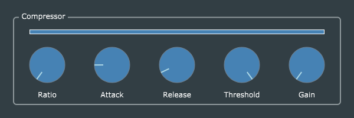

# Compressor

The *Compressor* effect is a straightforward port of Reiss and McPherson's original code, with all of the same parameter-handling and GUI enhancements you have already seen in *BasicGain*, *Tremolo*, and *RingMod*.

However, I have added one small GUI enhancement: a dynamic bar-graph indicator to visualize the current gain value (linear scale, 0 dB unity gain at the far right). The supporting code is added to *CompressorProcessor::computeCompressionGain()* (called simply *compressor()* in R&M's code). The decibel gain values computed in `y_l[]` for an entire buffer are averaged in a new local variable `yl_avg`, and then converted to a linear gain in the `currentGain` member variable, which is declared *public* so it is accessible to the GUI editor.

Computing average gain for an entire buffer of audio (typically 512 samples) provides a bit of smoothing, but note this is not a true moving-average filter. Further smoothing is probably unnecessary, as the "ballistics" computation already incorporates one-pole low-pass filters for attack and decay.

 To allow the GUI display to update in a timely fashion when `currentGain` changes, *CompressorProcessor* and *CompressorEditor* are defined as a *ChangeBroadcaster/ChangeListener* pair. This mechanism in JUCE is *thread-safe*, meaning it is OK for the processor to call *sendChangeMessage()* from the audio-rendering thread. The editor's *changeListenerCallback()* will be called some time later on the main/GUI thread, where it is safe to perform GUI update operations.

`currentGain` is an example of a variable which is shared between processor and editor, but is *not* considered part of the plug-in's *state*, and hence need not be included in the *AudioProcessorValueTreeState* or persisted by the *getStateInformation()/setStateInformation()* functions.
