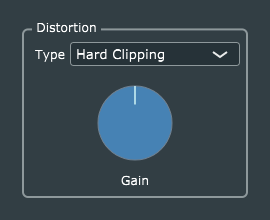

# Distortion

The *Distortion* effect is a straightforward port of Reiss and McPherson's original code, with only a few points worth noting:
1. I applied the same pattern for handling *enum* parameter types which was introduced in the *Tremolo* project, and took the opportunity to factor the actual wave-shaping code out of the processor class and into the new *Distortion* class.
2. The new *Distortion* class remains in the same folder as the *Distortion* effect itself; I didn't move it out into the *Common* folder because, unlike the LFO classes, this one is not used in any of the other effects.
3. This was the first project for which I used the code-generation templates found in the *Generator Scripts* folder. The auto-generated code needed only a bit of editing.

My thanks to GitHub user [Mike Cassidy](https://github.com/Mcas4150), who contributed a preliminary factoring of the interpolation code into what is now the *Distortion* class.
