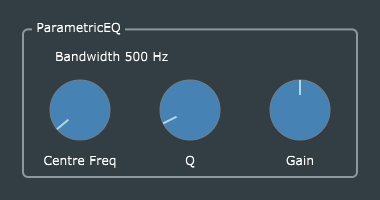

# Parametric EQ

This is a straightforward port of Reiss and McPherson's original code, with just a few changes to avoid deprecated JUCE function calls, plus the usual parameter-handling and GUI enhancements you have seen in the earlier projects.

The processor object (which owns the filters) needs to be informed when the parameter values change, in order to update the filter settings. This is implemented by making the processor an *AudioProcessorValueTreeState::Listener*. The listener callback is also a handy place to inform the GUI that it should update its display of the current filter bandwidth.

All three parameters (centre frequency, Q, and gain) affect the filter recomputation, but only the first two affect bandwidth. Hence it's conceivable to use the first argument to *ParametricEQProcessor::parameterChanged()* (which is the ID of the changed parameter) to skip sending the GUI-update message when only the gain is changed, but this is probably more trouble than it's worth.

## Comparison with practical parametric EQ designs
This is about the simplest kind of filter which qualifies as a "parametric EQ", because it uses only a single peak/notch filter. A more realistic parametric EQ for studio use would include at least two independent peak/notch filters, plus shelving low- and high-pass filters.
