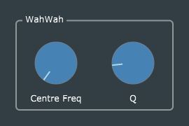

# Wah-Wah

This is a straightforward port of Reiss and McPherson's code, with basically the same modifications as we saw previously in the *Parametric EQ* effect, but a bit simpler because there is no need to track and display changes to the filter bandwidth.
