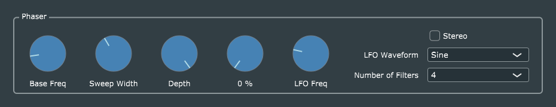

# Phaser

This is a straightforward port of Reiss and McPherson's original code, with the usual enhancements to parameter handling and the GUI.

I have updated their use of **juce::CriticalSection** a bit. In JUCE 5.x every **AudioProcessor** has a built-in **CriticalSection** member which gets locked while the host calls *processBlock()*. In *PhaserProcessor::allocateFilters()*, the only piece of the code which absolutely should not run while *processBlock* is running, I simply add one line at the top:

  const ScopedLock myScopedLock(getCallbackLock());

According to the JUCE documentation for *AudioProcessor::getCallbackLock()*:

> This returns a critical section that will automatically be locked while the host is calling the processBlock() method.

> Use it from your UI or other threads to lock access to variables that are used by the process callback, but obviously be careful not to keep it locked for too long, because that could cause stuttering playback.

Another place in the code which may not be immediately obvious is the constructor for *PhaserParameters*. The values of `depth` and `numFilters` are set manually to what the corresponding *AudioProcessorValueTreeState::Listener*s would set them to (with scaling and offsets applied), because the listeners don't get called until the parameter values actually change.
