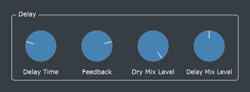

# Delay

This is a straightforward port of Reiss and McPherson's original code, with the usual GUI and parameter-handling enhancements.

As in the previous *Phaser* example, the body of the *DelayParameters* constructor applies the scaling factor 0.01 (to convert percentages [0, 100] to fractions [0, 1]) to the initial values of `feedback`, `dryLevel`, and `wetLevel`, because the listeners don't get called until the parameter values actually change.
