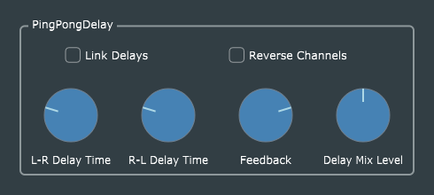

# Ping-Pong Delay

This is a straightforward port of Reiss and McPherson's original code, with the usual GUI and parameter-handling enhancements. The only interesting new aspect is the way the boolean parameters `linkDelays` and `reverseChannels` are managed. These are NOT included in the processor's *AudioProcessorValueTreeState*, because the don't need to be exposed to the host. They are conveniences for the GUI user; it would not make sense to automate them in a DAW. Therefore they have to be handled "manually" in the GUI editor, with explicit code, and persisted separately in the processor's *getStateInformation()* and *setStateInformation()* methods.

One could argue that only `linkDelays` is truly a "user convenience", and it might make sense to be able to automate the `reverseChannels` parameter. This would not be a difficult change to make, and is left as an exercise for the interested student.
