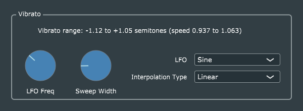

# Vibrato

This is a mostly-straightforward port of Reiss and McPherson's original code, with the usual GUI and parameter-handling updates.

My thanks to GitHub user [Mike Cassidy](https://github.com/Mcas4150), who contributed a preliminary factoring of the interpolation code into what is now the *VibratoInterpolation* class.

As in some other examples, use of *AudioProcessorValueTreeState::Listener* objects simplfies the process of keeping the GUI up-to-date (specifically the text describing the current vibrato range), BUT I learned something important working on this example. The processor's *parameterChanged()* method needs to be called AFTER my custom *Listener* objects, because the latter transform the updated parameter values into the working values referenced by the former. The JUCE documentation does not specify the calling order for multiple Listeners on a given parameter. It turns out that the order is the reverse of the order in which the Listeners are added, i.e., the most recently-added Listeners are called before Listeners added earlier. To obtain the necessary calling order, I had to add the processor first, then my custom Listeners, in the *VibratoParameters* constructor.

This kind of thing is unfortunately a fact of life when working with complex frameworks like JUCE. The framework authors can't always think of every possible case, so there will always be some undocumented (one might say, "emergent") behaviour which can only be discovered through experimentation.
