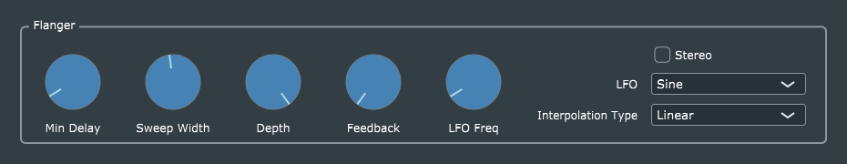

# Flanger

This is a straightforward port of Reiss and McPherson's code, with the usual GUI and parameter-handling enhancements. I have changed the time units (for Min Delay and Sweep Width) from seconds to milliseconds.
