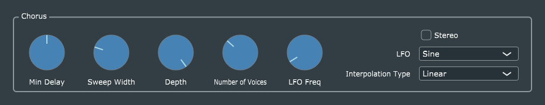

# Chorus

This is a straightforward port of Reiss and McPherson's code. Because chorus and flanger are nearly identical in structure, I built this project by cloning the previous Flanger project, renaming files/classes, updating the parameter ranges and default values, and making other code changes as required (mainly in the processor). I decided to use a knob for "number of voices", rather than a combo box as in the R&M example, to keep the GUI as similar as possible to the Flanger.
