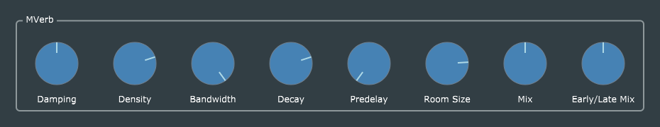

# Reverb 1 (MVerb)

This is a more-or-less straightforward port of Reiss and McPherson's original code, with the usual GUI and parameter-handling enhancements. I have chosen different default values for the MVerb parameters, and omitted the *Gain* knob, leaving the MVerb *Gain* parameter at 1.0 (100%).

## Project naming
I have named this project "MVerb" rather than the more generic "Reverb" (or R&M's original name "algoreverb"), to emphasize that the underlying reverberator code is [Martin Eastwood's MVerb](https://github.com/martineastwood/mverb). I have also written a second reverb plug-in based on the JUCE 5.x built-in reverb algorithm (which itself is based on [FreeVerb](https://ccrma.stanford.edu/~jos/pasp/Freeverb.html)), called "JVerb".

## Citation requirement

The header comments in R&M's original code include the following:
>   When using this code (or a modified version thereof) please cite:

>  R. Stables, S. Enderby, B. De Man, G. Fazekas, J. D. Reiss, "SAFE:
  A System for the Extraction and Retrieval of Semantic Audio
  Descriptors," 15th International Society for Music Information
  Retrieval Conference (ISMIR 2014), 2014.

I have read the paper in question, and I can't see any reason for this requirement. This is a straightforward JUCE wrapping of Martin Eastwood's MVerb code, and nothing remains of the specific data-gathering features which the paper mentions as having been added for the SAFE project.

## Issues with MVerb.h
The file *MVerb.h* unfortunately causes a modern C++ compiler to issue a great many warnings, because of rather cavalier mixing of data types. I attempted to revise it (see file *MVerb-edited.h*) and succeeded in eliminating all warnings, but evidently I also broke it, because the edited version does not sound the same, so I reverted to the original.
