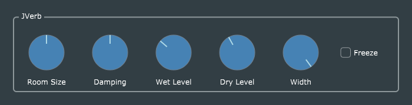

# Reverb 2 (JVerb)

JUCE 5.x includes a ready-made reverb implementation which itself is based on [FreeVerb](https://ccrma.stanford.edu/~jos/pasp/Freeverb.html)). I thought it might be interesting to create an effect plug-in using this **juce::Reverb** class, to facilitate comparison with Reiss and McPherson's [MVerb](https://github.com/martineastwood/mverb)-based example.

The JUCE reverb algorithm has an extra Boolean parameter called *freeze*. When this is set, the algorithm stops processing incoming data and enters a continuous feedback loop, replaying the reverberation sound repeatedly without any damping.

Because the **juce::Reverb** class is so easy to use, this serves as a code example only slightly more complex than *BasicGain*, allowing the interested student to focus on the GUI and parameter-handling (**juce::AudioProcessorValueTreeState**) implementation.
