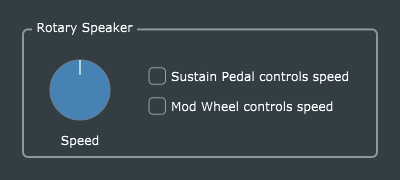

# Rotary Speaker (Leslie) simulator

The use of rotating loudspeakers to create a spacious, swirling sound was developed in the 1930s by inventor Donald Leslie. The [Leslie speaker](https://en.wikipedia.org/wiki/Leslie_speaker) cabinet, used together with a [Hammond tone-wheel organ](https://en.wikipedia.org/wiki/Hammond_organ), became so widely used and so beloved by jazz and rock keyboardists that it has become inextricably associated with the Hammond organ itself (much to the chagrin of Laurens Hammond, who disapproved).

The [setBfree project](http://setbfree.org/) has developed an excellent open-source emulator for the Hammond B-3, including with a highly sophisticated Leslie speaker emulation. The code is published under GPL2 and is available [on GitHub](https://github.com/pantherb/setBfree). A full plug-in implementation of this Leslie algorithm, including a detailed GUI to control all of its many parameters is available from [x42-plugins.com](http://x42-plugins.com/x42/x42-whirl). This project is a much simpler JUCE wrapping of the same code, with perhaps the simplest possible GUI, providing access only to the basic *rotation speed* parameter.

This code illustrates two practical techniques which are not addressed in any of the original Reiss and McPherson plug-ins:
1. Wrapping legacy C code in C++ for use with JUCE, and
2. Creating a *MIDI-controlled audio effect*, with the option to use MIDI to trigger changes in the Leslie rotation speed.

As with the *Ping-Pong Delay* example, this plug-in also features two (Boolean) parameters which are not represented in a **juce::AudioProcessorValueTreeState**, but must still be persisted along with the ValueTreeState contents in the processor's *getStateInformation()* and *setStateInformation()* methods.

An example of the same rotary-speaker code together with a simple tone-wheel organ emulation (far simpler than *setBfree*) can be found at https://github.com/AudioKit/ExtendingCore.
